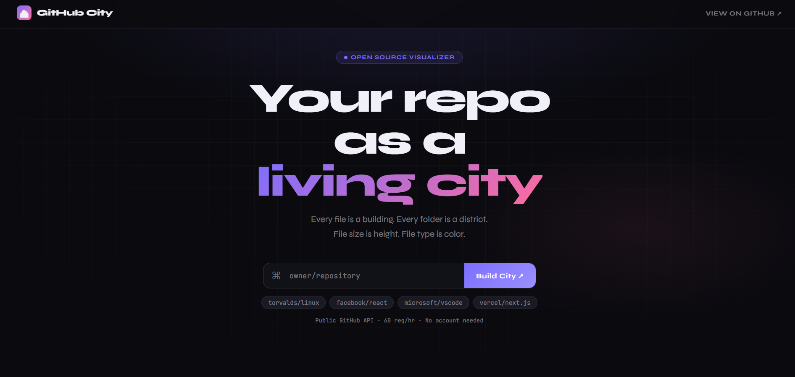
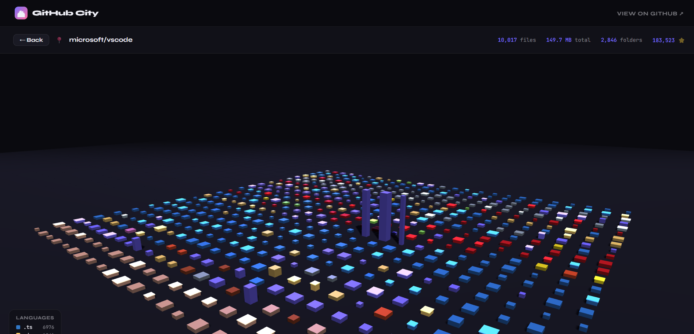

# 🏙 GitHub City

> **Visualize any GitHub repository as an interactive 3D city.**

**[🚀 Live Demo →](https://SnehaDeshmukh28.github.io/github-city)**

---





---

## What is this?

GitHub City turns any public GitHub repo into a flyover-able 3D city:

| Dimension | Meaning |
|-----------|---------|
| 🏗 **Building height** | File size — bigger files = taller buildings |
| 🎨 **Building color** | File type — JS is yellow, Python is blue, Rust is orange… |
| 💡 **Glow + pulse** | File activity — recently active files light up |
| 🗺 **Districts** | Folders — related files cluster together |

Just type any `owner/repo` and hit **Build City**.

---

## Features

- ✅ **Zero setup** — open `index.html` in a browser, done
- ✅ **No backend** — uses the GitHub public REST API directly
- ✅ **CORS proxy fallback** — works from `file://` and `localhost`
- ✅ **Interactive 3D** — drag to orbit, scroll to zoom, hover for file info
- ✅ **Large repos** — handles 6,000+ file repos (capped at 600 buildings for perf)
- ✅ **20+ languages** — color-coded by file extension
- ✅ **No dependencies to install** — Three.js loaded from CDN

---

## Quick start

```bash
# Option 1: just open the file
open index.html

# Option 2: serve locally (avoids any CORS edge cases)
python -m http.server 8080
# then visit http://localhost:8080
```

Or use the **[live hosted version](https://SnehaDeshmukh28.github.io/github-city)** — no install needed.

---

## Tech stack

| | |
|--|--|
| **3D rendering** | [Three.js r128](https://threejs.org) |
| **Data** | [GitHub REST API v3](https://docs.github.com/en/rest) |
| **Fonts** | [Syne](https://fonts.google.com/specimen/Syne) + [JetBrains Mono](https://fonts.google.com/specimen/JetBrains+Mono) |
| **Hosting** | GitHub Pages (auto-deploys on push to `main`) |
| **Build** | None — pure HTML/CSS/JS, single file |

---

## Language colors

| Extension | Color | Language |
|-----------|-------|----------|
| `.js` `.mjs` | 🟡 Yellow | JavaScript |
| `.ts` | 🔵 Blue | TypeScript |
| `.tsx` `.jsx` | 🩵 Cyan | React |
| `.py` | 🔵 Steel Blue | Python |
| `.rs` | 🟠 Salmon | Rust |
| `.go` | 🩵 Cyan | Go |
| `.rb` | 🔴 Red | Ruby |
| `.css` `.scss` | 🩷 Pink | Styles |
| `.html` | 🟠 Orange | HTML |
| `.json` | 🟡 Amber | JSON |
| `.md` | 🩶 Gray | Markdown |
| `.sh` `.bash` | 🟢 Green | Shell |

---

## Roadmap

- [ ] Click building → open file on GitHub
- [ ] Real commit recency via GitHub API (requires token for rate limits)
- [ ] Animated city-spawn effect on load
- [ ] Color by commit author instead of file type
- [ ] Export/share screenshot button
- [ ] Private repo support (token input)
- [ ] Folder-grouped districts with visible boundaries

---

## Deploying your own

1. **Fork** this repo
2. Go to **Settings → Pages**
3. Set source to **GitHub Actions**
4. Push anything to `main` — the action deploys automatically

Your city will be live at `https://YOUR_USERNAME.github.io/github-city`

---

## API limits

The GitHub public API allows **60 requests/hour** without authentication. Each city build uses 2 requests (repo info + file tree). If you hit limits, wait a minute or add a GitHub token.

---

## License

MIT — use it, fork it, tweet it. If you share a cool city screenshot, tag it `#GitHubCity` 🏙

---

<p align="center">Built with Three.js + the GitHub API · No frameworks, no build step, no nonsense</p>